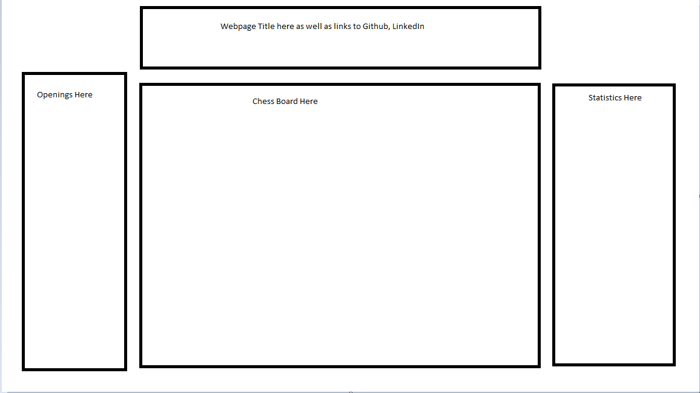
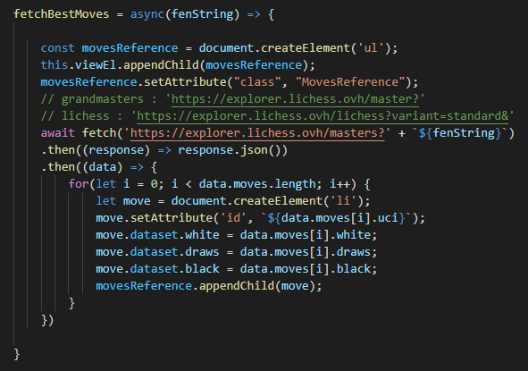
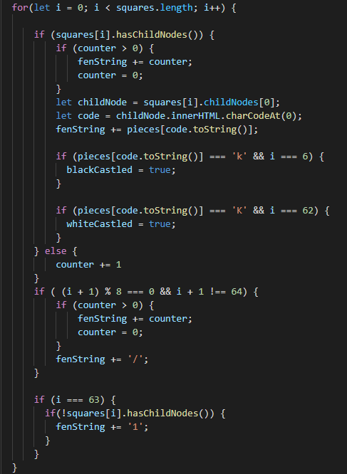
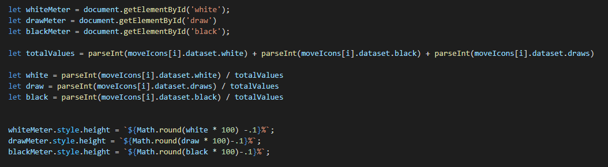
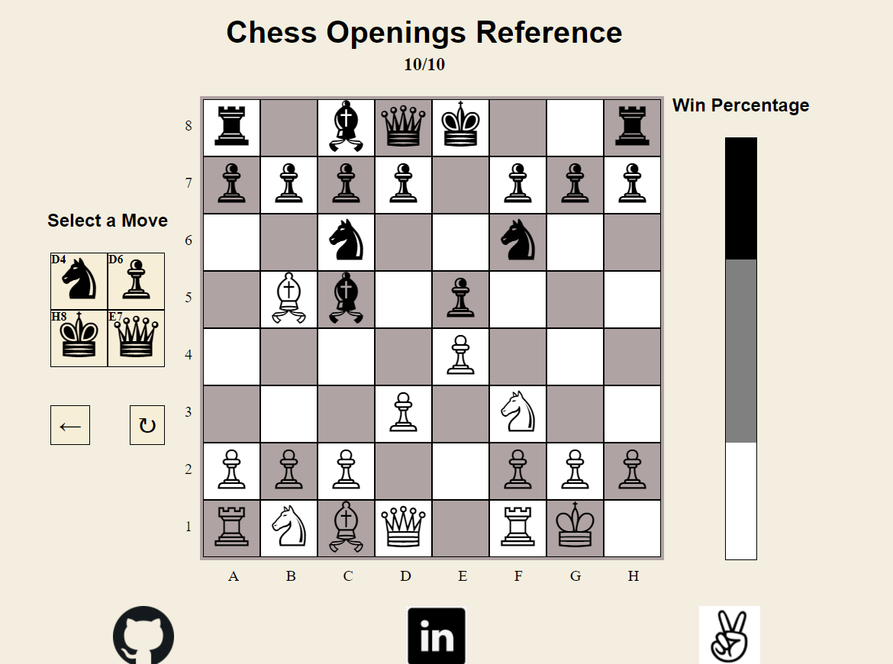

Chess is a game with uncountable positions and contingencies, but among these positions are opening positions, which are much more quantifiable and can lead to more favorable positons in the middle game if studied. The purpose of this project is to display the most popular and efficient chess openings accompanied win-percentage statisics.

In the Chess Openings page, users are able to:

1. Allow the user to select a move from the suggested moves
2. See how that move affects the favorability of the position

Here is a wireframe of the layout of the page going into development.

* Technologies include:
  * Lichess open source Api to reference chess moves and position analysis
  * Javascript to dynamically alter the page
  * HTML and CSS for structure and styling
  * Babel and Webpack for testing and development

The following function utilizes the JavaScript fetch method to asertain the best moves played by any given position. This function takes in a fenString (more on that later) and queries the lichess.org API for games played by chess grandmasters. After awaiting the fetch, we create a series of li elements and append them to a ul element which will display each move (see the wireframe). 

The main custom function that makes the application possible is the generateFenString function. Chess and computor science share some history together, going back to Deep Blue (an AI) defeated the chess world champion Garry Kasporov. 'FEN' is an abbreviation for Forsyth-Edwards Notation, a string that represents the postion of a chess board. 

The following is a an example of a FEN string which denotes a starting positon: 

rnbqkbnr/pppppppp/8/8/8/8/PPPPPPPP/RNBQKBNR w KQkq - 0 1

[Click here to learn more about decipering a position with a given Fen string](https://www.chess.com/terms/fen-chess)

As you might have guessed, the generateFenString function iterates through the board and builds up a string which we then feed to the earlier function, then retrieving the best responses. This is a long funtion, but here is most of the logic: 

 

Finally users are able to see percentages of white winning, black winning, or a draw. This data is retrieved with the fetchBestMoves function, and with a little math and a few lines I am able to display a dynamically changing meter displaying these percentages: 

As an avid chess player, this application was a passion project for me and it turned out to be a tool that I can use to improve my chess! This was my first larger scale project as a developer and I am very happy how it turned out, here is a quick screenshot of the application in its current state!

